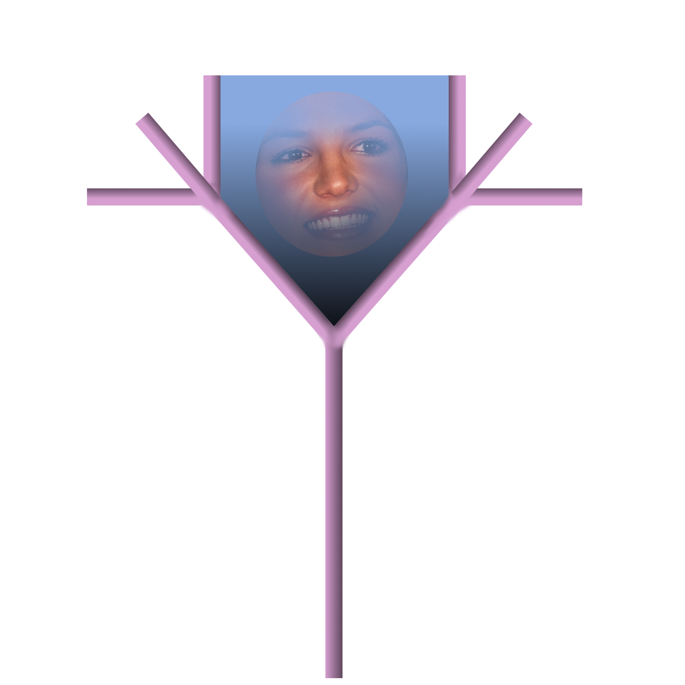

# Antheia



A web-based graphical demo with a theme of a pseudo-randomly generated, animated
garden, using [TypeScript](https://www.typescriptlang.org/) and [p5.js](https://p5js.org/).

## Table of contents

* [Antheia](#antheia)
  * [Table of contents](#table-of-contents)
  * [Features](#features)
  * [Documentation](#documentation)
  * [Development dependencies](#development-dependencies)
  * [Building and running the server](#building-and-running-the-server)
    * [Standalone](#standalone)
    * [VS Code](#vs-code)
  * [Code structure](#code-structure)
  * [Debugging](#debugging)
    * [Additional dependencies](#additional-dependencies)
    * [VS Code](#vs-code-1)
  * [Known issues](#known-issues)
  * [Demo](#demo)
  * [License](#license)

## Features

* Pseudo-3D, pseudo-randomly generated fractal trees on a 3D ground plane.
* Animated clouds.
* Gradient skybox.
* Light sources.
* Extensible object-oriented drawing framework.

## Documentation

* POSIX shell commands to be run as user are denoted by shell code blocks.
* 'Visual Studio Code' and 'Code - OSS' are abbreviated to VS Code.
* Documentation and code symbols are written in United States English in order
  to adhere to international standards and frameworks.

## Development dependencies

- `yarn`

## Building and running the server

The local server runs on http://localhost:8080. This page is accessible via a
web browser; supported browsers are [Chromium](https://www.chromium.org/Home/)
(version 100 and newer) and [Mozilla Firefox](https://www.mozilla.org/en-GB/firefox/)
(version 100 and newer).

### Standalone

```shell
yarn install && yarn serve
```

### VS Code

* Run Build Task (`Start development environment`)
    * Default keybind: `shift + ctrl/cmd + b`

## Code structure

* Written in TypeScript, HTML, and CSS.
* Built and run using [Yarn](https://yarnpkg.com/) and [Parcel](https://parceljs.org/).
* Lines are no longer than 80 characters, unless readability is affected.
* Tab width is 4 spaces, excluding generated files such as `package.json` in
  which the default of a given tool is used.
* Source code is located in `src/`.
* Uses [JSDoc](https://jsdoc.app/) comments.

## Debugging

### Additional dependencies

* `chromium` >= 100

### VS Code

* Run the default launch task (`Launch Chrome against localhost`)
    * Default keybind: `F5`

## Known issues

* Low framerate.
* Browser crashes may occur when continuously building and debugging, as drawing
  fractals with global lighting is difficult to optimize in WebGL.
* Skybox corners don't fully render depending on the camera angle.
* Tree branches intersect and have attribute-dependent reliability.
* Welcome title is not precicely horizontally centered.
* Clouds transformed positively on the axis (behind the initial camera) are
  incorrectly lit.
* Canvas objects are placed below the top of the ground plane on the y-axis.

## Demo

***Note:** This screen capture was exported at a lower framerate than when run
in a browser.*


## License

Copyright (c) 2022 Natalie Wiggins.

This program is free software: you can redistribute it and/or modify
it under the terms of the GNU General Public License as published by
the Free Software Foundation, either version 3 of the License, or
(at your option) any later version.

This program is distributed in the hope that it will be useful,
but WITHOUT ANY WARRANTY; without even the implied warranty of
MERCHANTABILITY or FITNESS FOR A PARTICULAR PURPOSE. See the
GNU General Public License for more details.

You should have received a copy of the GNU General Public License
along with this program. If not, see <https://www.gnu.org/licenses/>.

Written by Natalie Wiggins.

Static fonts are held under a different license (see [`static/fonts/noto/LICENSE`](static/fonts/noto/LICENSE)).

See `LICENSE` and `AUTHORS` for more information.